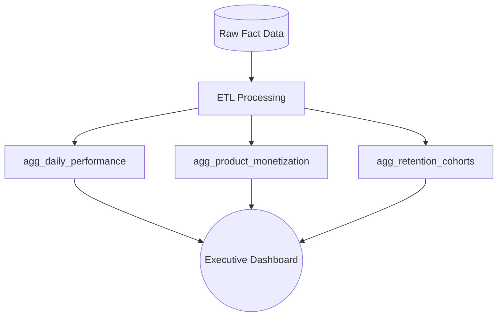

# 02 - Daily Performance Tracking: Data Layer

This folder contains the core ETL processes and transformation logic designed to monitor game health and player behavior. These queries aggregate raw transactional data into high-performance summary tables ready for the Executive Dashboard.

## Data Workflow

## Repository Structure

The data transformation is divided into three specialized SQL scripts, each serving a unique role in the dashboard architecture:

### 1. agg_daily_performance.sql

*** Purpose:** Foundations for the Executive Dashboard and Daily KPIs.

*** Granularity:** Date, Country, and Device Level.

*** Logic:** Aggregates raw facts into daily metrics (DAU, Revenue, Installs).

*** Key Metrics:** Daily Active Users, Total Revenue (USD), and New User Acquisitions.

*** Usage:** Powers the primary KPI scorecards and trend charts.

### 2. agg_product_monetization.sql

*** Purpose:** Internal Economy Analysis and LTV Tracking.

*** Granularity:** User and Product Level.

*** Logic:** Maps product groups (Spins, Coins, etc.) against player progression (Villages).

*** Key Metrics:** Revenue per Product Group, Max Village Reached, and Cumulative LTV.

*** Usage:** Powers the "Village Economy" deep-dive and monetization breakdown.

### 3. agg_retention_cohorts.sql

*** Purpose:** Long-term Engagement and Cohort Analysis.

*** Granularity:** Cohort (Install Date) and Day-in-Game Level.

*** Logic:** Tracks return rates at industry-standard milestones (D1-D60).

*** Key Metrics:** Retention Rate (%), Active Users per Cohort, and Cohort Size.

*** Usage:** Powers the Retention Matrix and engagement benchmarks.

### Tech Stack

*** Database:** Google BigQuery

*** Visualization:** Looker Studio

*** SQL Dialect:** Standard SQL
